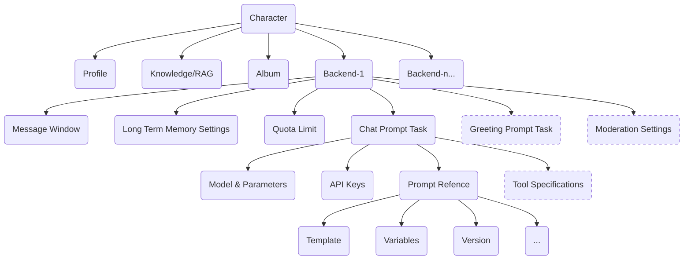

# FreeChat：用 AI 为自己创造一些朋友

[English](https://github.com/freechat-fun/freechat/blob/main/README.md) | 中文版

## 介绍
欢迎！FreeChat 的宗旨是构建一个云原生、健壮并且可快速商用化的企业级 AI 虚拟角色平台。

它也能作为一个 prompt engineering 平台。

## 特性
- 主要使用 Java 并强调**安全性、健壮性、扩展性、可追踪、可维护**。
- 拥有**账号体系与权限管理**，支持 OAuth2 认证方式。引入了“组织”概念以及相关权限约束功能。
- 广泛采用分布式技术与缓存，以支持**高并发**访问。
- 提供灵活的角色定制选项，支持直接干预 prompt，支持**为每个角色配置多个后端**。
- **提供全方位的 Open APIs**，拥有超过 180 个接口并提供 java/python/typescript sdk。借助这些接口，可轻松构建面向终端用户的系统。
- 支持为角色设置 **RAG** (Retrieval Augmented Generation)。
- 支持角色的**长期记忆，预设记忆**。
- 支持角色唤起**主动聊天**
- 支持为角色设置**配额限制**。
- 支持角色的**导入和导出**
- 支持单独**调试与分享 prompt**。

## 快照
### PC 端页面
#### 主页

#### 开发视图

#### 聊天视图


### 移动端页面
 <br />
 

## 角色设计


为一个角色设置了统一的人设和知识后，可以配置不同的后端。例如基于成本考虑为不同用户采用不同模型。

## 如何运行
### 在线网站
您可以访问 [freechat.fun](https://www.freechat.fun) 来体验 FreeChat，请分享您设计的 AI 角色！

### 运行在 Kubernetes 集群中
FreeChat 致力于云原生的设计理念。若您有 Kubernetes 集群，可按以下步骤将 FreeChat 部署至您的环境中：

1. 将 Kubernetes 配置文件放在 `configs/helm/` 目录下，命名为 `kube-private.conf`。
2. 将 Helm 配置文件放置在同目录下，命名为 `values-private.yaml`。确保参考默认的 `values.yaml` 并根据需求自定义变量。
3. 切换到 `scripts/` 目录。
4. 如有需要，执行 `install-in.sh` 在 Kubernetes 集群上部署 `ingress-nginx`。
5. 如有需要，运行 `install-cm.sh` 在 Kubernetes 集群上部署 `cert-manager`，它能自动为 `ingress.hosts` 中指定的域名颁发证书。
6. 运行 `install-pvc.sh` 安装 PersistentVolumeClaim 资源。

    > 默认情况下，FreeChat 采用访问“本地文件系统”的方式操作文件。你可能想要使用云上的高可用分布式存储。作为面向云原生设计的系统，我们建议通过 Kubernetes 的 CSI 来对接，避免单独适配每个云平台的存储产品。多数云服务商为 Kubernetes 提供了云存储驱动，并预定义了一系列的 StorageClass 资源。请根据您的实际需要选择合适的配置，并配置到 Helm 的 `global.storageClass` 选项。
    >
    > *将来，FreeChat 可能会重构为直接使用 MinIO 的 APIs，因为它现在已经作为依赖项被安装到了 Kubernetes 集群中（服务于 Milvus）。*

7. 执行 `install.sh` 脚本来安装 FreeChat 及其依赖项。
8. FreeChat 的目标是提供 Open API 服务。如果您喜欢 [freechat.fun](https://freechat.fun) 的交互体验，请运行 `install-web.sh` 来部署前端应用。
9. 执行 `restart.sh` 以重启服务。
10. 若您修改了任何 Helm 配置文件，请使用 `upgrade.sh` 进行相应的 Kubernetes 资源更新。
11. 要移除特定资源，请运行与您想要卸载的资源对应的 `uninstall*.sh` 脚本。

作为云原生应用，FreeChat 所依赖的服务均通过 helm repository 获取并部署到您的集群中。

如果您更倾向于使用具备 SLA(Service Level Agreement) 保障的云服务，只需在 `configs/helm/values-private.yaml` 中做相应设定：
```yaml
mysql:
  deployment:
    enabled: false
  url: <your mysql url>
  auth:
    rootPassword: <your mysql root password>
    username: <your mysql username>
    password: <your mysql password for the username>

redis:
  deployment:
    enabled: false
  url: <your redis url>
  auth:
    password: <your redis password>


milvus:
  deployment:
    enabled: false
  url: <your milvus url>
  milvus:
    auth:
      token: <your milvus api-key>
```

这样一来，FreeChat 将不自动安装这些服务，而是直接利用配置信息进行连接。

如果您的 Kubernetes 集群没有独立的监控系统，您可以启用以下开关。 这会将 Prometheus 和 Grafana 服务安装在同一命名空间中，专门用于监控 FreeChat 应用程序下的服务状态：
```yaml
prometheus:
  deployment:
    enabled: true
grafana:
  deployment:
    enabled: true
```

### 运行在本地
您同样可以在本地运行 FreeChat。目前支持 MacOS 和 Linux（实际上，仅在 MacOS 上进行了测试）。您需要安装 Docker 工具集，并拥有能访问到 [Docker Hub](https://hub.docker.com/) 的网络。

准备就绪后，进入 `scripts/` 目录，运行 `local-run.sh`，该脚本将下载并运行所需的 docker 容器。启动成功后，即可通过浏览器访问 `http://localhost` 查看本地运行的 freechat.fun。内置的管理员账号与密码是“admin:freechat”。可以通过 `local-run.sh --help` 查看脚本所支持的选项。祝您顺利！

### 运行在 IDE
要在 IDE 中运行 FreeChat，你需要先启动所有依赖服务，但不必运行 FreeChat 应用本身的容器。你可以执行 `scripts/local-deps.sh` 脚本来本地启动 `MySQL`、`Redis`、`Milvus` 等服务。完成后，在你的 IDE 中打开并调试 `freechat-start/src/main/java/fun/freechat/Application.java`。请确保你设置了以下的 VM 启动参数：
```shell
-Dspring.config.location=classpath:/application.yml,classpath:/application-local.yml \
-DAPP_HOME=local-data/freechat \
-Dspring.profiles.active=local
```

### 使用 SDK
#### Java
- **依赖**
```xml
<dependency>
  <groupId>fun.freechat</groupId>
  <artifactId>freechat-sdk</artifactId>
  <version>${freechat-sdk.version}</version>
</dependency>
```

- **示例**
```java
import fun.freechat.client.ApiClient;
import fun.freechat.client.ApiException;
import fun.freechat.client.Configuration;
import fun.freechat.client.api.AccountApi;
import fun.freechat.client.auth.ApiKeyAuth;
import fun.freechat.client.model.UserDetailsDTO;

public class AccountClientExample {
    public static void main(String[] args) {
        ApiClient defaultClient = Configuration.getDefaultApiClient();
        defaultClient.setBasePath("https://freechat.fun");

        // Configure HTTP bearer authorization: bearerAuth
        HttpBearerAuth bearerAuth = (HttpBearerAuth) defaultClient.getAuthentication("bearerAuth");
        bearerAuth.setBearerToken("FREECHAT_TOKEN");

        AccountApi apiInstance = new AccountApi(defaultClient);
        try {
            UserDetailsDTO result = apiInstance.getUserDetails();
            System.out.println(result);
        } catch (ApiException e) {
            e.printStackTrace();
        }
    }
}
```

#### Python
- **安装**
```shell
pip install freechat-sdk
```

- **示例**
```python
import freechat_sdk
from freechat_sdk.rest import ApiException
from pprint import pprint

# Defining the host is optional and defaults to https://freechat.fun
# See configuration.py for a list of all supported configuration parameters.
configuration = freechat_sdk.Configuration(
    host = "https://freechat.fun"
)

# Configure Bearer authorization: bearerAuth
configuration = freechat_sdk.Configuration(
    access_token = os.environ["FREECHAT_TOKEN"]
)

# Enter a context with an instance of the API client
with freechat_sdk.ApiClient(configuration) as api_client:
    # Create an instance of the API class
    api_instance = freechat_sdk.AccountApi(api_client)

    try:
        details = api_instance.get_user_details()
        pprint(details)
    except ApiException as e:
        print("Exception when calling AccountClient->get_user_details: %s\n" % e)
```

#### TypeScript
- **安装**
```shell
npm install freechat-sdk --save
```

- **示例**

参考 [FreeChatApiContext.tsx](https://github.com/freechat-fun/freechat/blob/main/freechat-web/src/contexts/FreeChatApiProvider.tsx)

## 系统依赖
| | Projects
| ---- | ----
| Application Framework | [Spring Boot](https://spring.io/projects/spring-boot/)
| LLM Framework | [LangChain4j](https://docs.langchain4j.dev/)
| Model Providers | [OpenAI](https://platform.openai.com/), [Azure OpenAI](https://oai.azure.com/), [DashScope(Alibaba)](https://dashscope.aliyun.com/)
| Database Systems | [MySQL](https://www.mysql.com/), [Redis](https://redis.io/), [Milvus](https://milvus.io/)
| Monitoring & Alerting | [Kube State Metrics](https://kubernetes.io/docs/concepts/cluster-administration/kube-state-metrics/), [Prometheus](https://prometheus.io/), [Promtail](https://grafana.com/docs/loki/latest/send-data/promtail/), [Loki](https://grafana.com/oss/loki/), [Grafana](https://grafana.com/)
| OpenAPI Tools | [Springdoc-openapi](https://springdoc.org/), [OpenAPI Generator](https://github.com/OpenAPITools/openapi-generator), [OpenAPI Explorer](https://github.com/Authress-Engineering/openapi-explorer)

## 合作
### 应用接入
FreeChat 系统是完全 Open API 导向的。站点 [freechat.fun](https://freechat.fun) 使用其 TypeScript SDK 进行开发，几乎不依赖私有接口。你可以使用这些在线接口，开发自己的端侧应用或者站点，使其符合你喜欢的样子。目前，FreeChat 是完全免费的，也暂时没有收费计划（毕竟，用户使用自己的 API Key 来调用 LLM 服务）。

### 模型接入
FreeChat 旨在探索具有拟人化特征的 AI 虚拟角色技术。到目前为止，它支持 OpenAI GPT 和阿里巴巴通义千问系列模型。但我们更感兴趣的是，支持那些正在研究中、能让 AI 具备更多人格特征的模型。如果你在这方面有所研究，并且希望 FreeChat 支持你的模型，请和我们取得联系。我们期待 AI 技术在未来能帮助人们塑造出自己的“灵魂伴侣”。
