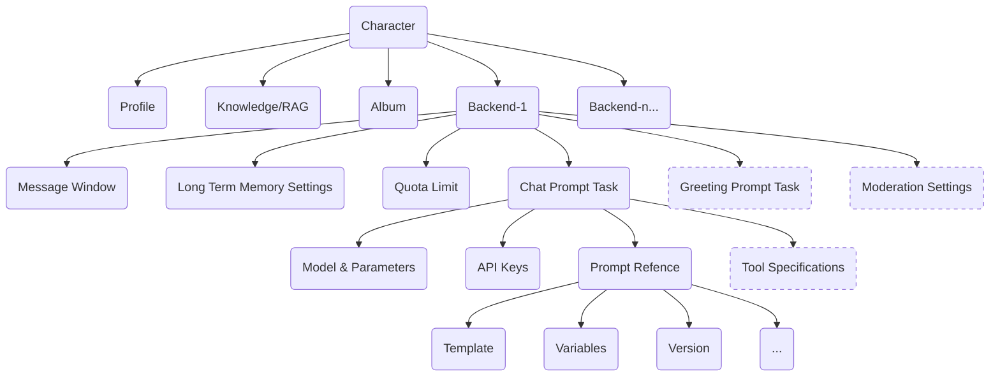

# freechat-sdk

FreeChat OpenAPI Definition
- API version: 1.0.2
  - Generator version: 7.5.0

# FreeChat: Create Some Friends for Yourself with AI

English | [中文版](https://github.com/freechat-fun/freechat/blob/main/README.zh-CN.md)

## Introduction
Welcome! FreeChat aims to build a cloud-native, robust, and quickly commercializable enterprise-level AI virtual character platform.

## Features
- Primarily uses Java and emphasizes **security, robustness, scalability, traceability, and maintainability**.
- Boasts **account systems and permission management**, supporting OAuth2 authentication. Introduces the \"organization\" concept and related permission constraint functions.
- Extensively employs distributed technologies and caching to support **high concurrency** access.
- Provides flexible character customization options, supports direct intervention in prompts, and supports **configuring multiple backends for each character**.
- **Offers a comprehensive range of Open APIs**, with more than 180 interfaces and provides java/python/typescript SDKs. These interfaces enable easy construction of systems for end-users.
- Supports setting **RAG** (Retrieval Augmented Generation) for characters.
- Supports **long-term memory** for characters.
- Supports setting **quota limits** for characters.

## System Snapshots

## Character Design


After setting up a unified persona and knowledge for a character, different backends can be configured. For example, different model may be adopted for different users based on cost considerations.

## How to Play
### Online Website
You can visit [freechat.fun](https://freechat.fun) to experience FreeChat. Share your designed AI character!

### Running in a Kubernetes Cluster
FreeChat is dedicated to the principles of cloud-native design. If you have a Kubernetes cluster, you can deploy FreeChat to your environment by following these steps:

1. Put the Kubernetes configuration file in the `configs/helm/` directory, named `kube-private.conf`.
2. Place the Helm configuration file in the same directory, named `values-private.yaml`. Make sure to reference the default `values.yaml` and customize the variables as needed.
3. Switch to the `scripts/` directory.
4. If needed, run `install-in.sh` to deploy `ingress-nginx` on the Kubernetes cluster.
5. If needed, run `install-cm.sh` to deploy `cert-manager` on the Kubernetes cluster, which automatically issues certificates for domains specified in `ingress.hosts`.
6. Run `install-pvc.sh` to install PersistentVolumeClaim resources.

    > By default, FreeChat operates files by accessing the \"local file system.\" You may want to use high-availability distributed storage in the cloud. As a cloud-native-designed system, we recommend interfacing through Kubernetes CSI to avoid individually adapting storage products for each cloud platform. Most cloud service providers offer cloud storage drivers for Kubernetes, with a series of predefined StorageClass resources. Please choose the appropriate configuration according to your actual needs and set it in Helm's `global.storageClass` option.
    > 
    > *In the future, FreeChat may be refactored to use MinIO's APIs directly, as it is now installed in the Kubernetes cluster as a dependency (serving Milvus).*

7. Run `install.sh` script to install FreeChat and its dependencies.
8. FreeChat aims to provide Open API services. If you like the interactive experience of [freechat.fun](https://freechat.fun), run `install-web.sh` to deploy the front-end application.
9. Run `restart.sh` to restart the service.
10. If you modified any Helm configuration files, use `upgrade.sh` to update the corresponding Kubernetes resources.
11. To remove specific resources, run the `uninstall*.sh` script corresponding to the resource you want to uninstall.

As a cloud-native application, the services FreeChat relies on are obtained and deployed to your cluster through the helm repository.

If you prefer cloud services with SLA (Service Level Agreement) guarantees, simply make the relevant settings in `configs/helm/values-private.yaml`:
```yaml
bitnami:
  mysql:
    enabled: false
  redis:
    enabled: false
  milvus:
    enabled: false

mysql:
  url: <your mysql url>
  auth:
    rootPassword: <your mysql root password>
    username: <your mysql username>
    password: <your mysql password for the username>

redis:
  url: <your redis url>
  auth:
    password: <your redis password>


milvus:
  url: <your milvus url>
  milvus:
    auth:
      token: <your milvus api-key>
```

With this, FreeChat will not automatically install these services, but rather use the configuration information to connect directly.

### Running Locally
You can also run FreeChat locally. Currently supported on MacOS and Linux (although only tested on MacOS). You need to install the Docker toolset and have a network that can access [Docker Hub](https://hub.docker.com/).

Once ready, enter the `scripts/` directory and run `local-run.sh`, which will download and run the necessary docker containers. After a successful startup, you can access `http://localhost` via a browser to see the locally running freechat.fun. Use `local-run.sh --help` to view the supported options of the script. Good luck!

### Running in an IDE
To run FreeChat in an IDE, you need to start all dependent services first but do not need to run the container for the FreeChat application itself. You can execute the `scripts/local-deps.sh` script to start services like `MySQL`, `Redis`, `Milvus`, etc., locally. Once done, open and debug `freechat-start/src/main/java/fun/freechat/Application.java`。Make sure you have set the following startup parameters:
```shell
-Dspring.config.location=classpath:/application.yml,classpath:/application-local.yml \\
-DAPP_HOME=local-data/freechat \\
-Dspring.profiles.active=local
```

### 使用 SDK
#### Java
- **Dependency**
```xml
<dependency>
  <groupId>fun.freechat</groupId>
  <artifactId>freechat-sdk</artifactId>
  <version>${freechat-sdk.version}</version>
</dependency>
```

- **Example**
```java
import fun.freechat.client.ApiClient;
import fun.freechat.client.ApiException;
import fun.freechat.client.Configuration;
import fun.freechat.client.api.AccountApi;
import fun.freechat.client.auth.ApiKeyAuth;
import fun.freechat.client.model.UserDetailsDTO;

public class AccountClientExample {
    public static void main(String[] args) {
        ApiClient defaultClient = Configuration.getDefaultApiClient();
        defaultClient.setBasePath(\"https://freechat.fun\");
        
        // Configure HTTP bearer authorization: bearerAuth
        HttpBearerAuth bearerAuth = (HttpBearerAuth) defaultClient.getAuthentication(\"bearerAuth\");
        bearerAuth.setBearerToken(\"FREECHAT_TOKEN\");

        AccountApi apiInstance = new AccountApi(defaultClient);
        try {
            UserDetailsDTO result = apiInstance.getUserDetails();
            System.out.println(result);
        } catch (ApiException e) {
            e.printStackTrace();
        }
    }
}
```

#### Python
- **Installation**
```shell
pip install freechat-sdk
```

- **Example**
```python
import freechat_sdk
from freechat_sdk.rest import ApiException
from pprint import pprint

# Defining the host is optional and defaults to https://freechat.fun
# See configuration.py for a list of all supported configuration parameters.
configuration = freechat_sdk.Configuration(
    host = \"https://freechat.fun\"
)

# Configure Bearer authorization: bearerAuth
configuration = freechat_sdk.Configuration(
    access_token = os.environ[\"FREECHAT_TOKEN\"]
)

# Enter a context with an instance of the API client
with freechat_sdk.ApiClient(configuration) as api_client:
    # Create an instance of the API class
    api_instance = freechat_sdk.AccountApi(api_client)

    try:
        details = api_instance.get_user_details()
        pprint(details)
    except ApiException as e:
        print(\"Exception when calling AccountClient->get_user_details: %s\\n\" % e)
```

#### TypeScript
- **Installation**
```shell
npm install freechat-sdk --save
```

- **Example**

Refer to [FreeChatApiContext.tsx](https://github.com/freechat-fun/freechat/blob/main/freechat-web/src/contexts/FreeChatApiProvider.tsx)

## System Dependencies
| | Projects
| ---- | ----
| Application Framework | [Spring Boot](https://spring.io/projects/spring-boot/)
| LLM Framework | [LangChain4j](https://docs.langchain4j.dev/)
| Model Providers | [OpenAI](https://platform.openai.com/), [DashScope](https://dashscope.aliyun.com/)
| Database Systems | [MySQL](https://www.mysql.com/), [Redis](https://redis.io/), [Milvus](https://milvus.io/)
| OpenAPI Tools | [Springdoc-openapi](https://springdoc.org/), [OpenAPI Generator](https://github.com/OpenAPITools/openapi-generator), [OpenAPI Explorer](https://github.com/Authress-Engineering/openapi-explorer)

## Collaboration
### Application Integration
The FreeChat system is entirely oriented towards Open APIs. The site [freechat.fun](https://freechat.fun) is developed using its TypeScript SDK and hardly depends on private interfaces. You can use these online interfaces to develop your own applications or sites, making them fit your preferences. Currently, FreeChat is completely free with no paid plans (after all, users use their own API Key to call LLM services).

### Model Integration
FreeChat aims to explore AI virtual character technology with anthropomorphic characteristics. So far, it supports model services from OpenAI and DashScope ([HuggingFace](https://huggingface.co/) is also expected to be supported soon). However, we are more interested in supporting models that are under research and can endow AI with more personality traits. If you are researching this area and hope FreeChat supports your model, please contact us. We look forward to AI technology helping people create their own \"soul mates\" in the future.


*Automatically generated by the [OpenAPI Generator](https://openapi-generator.tech)*


## Requirements

Building the API client library requires:
1. Java 1.8+
2. Maven (3.8.3+)/Gradle (7.2+)

## Installation

To install the API client library to your local Maven repository, simply execute:

```shell
mvn clean install
```

To deploy it to a remote Maven repository instead, configure the settings of the repository and execute:

```shell
mvn clean deploy
```

Refer to the [OSSRH Guide](http://central.sonatype.org/pages/ossrh-guide.html) for more information.

### Maven users

Add this dependency to your project's POM:

```xml
<dependency>
  <groupId>fun.freechat</groupId>
  <artifactId>freechat-sdk</artifactId>
  <version>1.0.2</version>
  <scope>compile</scope>
</dependency>
```

### Gradle users

Add this dependency to your project's build file:

```groovy
  repositories {
    mavenCentral()     // Needed if the 'freechat-sdk' jar has been published to maven central.
    mavenLocal()       // Needed if the 'freechat-sdk' jar has been published to the local maven repo.
  }

  dependencies {
     implementation "fun.freechat:freechat-sdk:1.0.2"
  }
```

### Others

At first generate the JAR by executing:

```shell
mvn clean package
```

Then manually install the following JARs:

* `target/freechat-sdk-1.0.2.jar`
* `target/lib/*.jar`

## Getting Started

Please follow the [installation](#installation) instruction and execute the following Java code:

```java

// Import classes:
import fun.freechat.client.ApiClient;
import fun.freechat.client.ApiException;
import fun.freechat.client.Configuration;
import fun.freechat.client.auth.*;
import fun.freechat.client.models.*;
import fun.freechat.client.api.AccountApi;

public class Example {
  public static void main(String[] args) {
    ApiClient defaultClient = Configuration.getDefaultApiClient();
    defaultClient.setBasePath("http://127.0.0.1:8080");
    
    // Configure HTTP bearer authorization: bearerAuth
    HttpBearerAuth bearerAuth = (HttpBearerAuth) defaultClient.getAuthentication("bearerAuth");
    bearerAuth.setBearerToken("BEARER TOKEN");

    AccountApi apiInstance = new AccountApi(defaultClient);
    try {
      String result = apiInstance.createToken();
      System.out.println(result);
    } catch (ApiException e) {
      System.err.println("Exception when calling AccountApi#createToken");
      System.err.println("Status code: " + e.getCode());
      System.err.println("Reason: " + e.getResponseBody());
      System.err.println("Response headers: " + e.getResponseHeaders());
      e.printStackTrace();
    }
  }
}

```

## Documentation for API Endpoints

All URIs are relative to *http://127.0.0.1:8080*

Class | Method | HTTP request | Description
------------ | ------------- | ------------- | -------------
*AccountApi* | [**createToken**](docs/AccountApi.md#createToken) | **POST** /api/v1/account/token | Create API Token
*AccountApi* | [**createToken1**](docs/AccountApi.md#createToken1) | **POST** /api/v1/account/token/{duration} | Create API Token
*AccountApi* | [**deleteToken**](docs/AccountApi.md#deleteToken) | **DELETE** /api/v1/account/token/{token} | Delete API Token
*AccountApi* | [**deleteTokenById**](docs/AccountApi.md#deleteTokenById) | **DELETE** /api/v1/account/token/id/{id} | Delete API Token by Id
*AccountApi* | [**disableToken**](docs/AccountApi.md#disableToken) | **PUT** /api/v1/account/token/{token} | Disable API Token
*AccountApi* | [**disableTokenById**](docs/AccountApi.md#disableTokenById) | **PUT** /api/v1/account/token/id/{id} | Disable API Token by Id
*AccountApi* | [**getTokenById**](docs/AccountApi.md#getTokenById) | **GET** /api/v1/account/token/id/{id} | Get API Token by Id
*AccountApi* | [**getUserBasic**](docs/AccountApi.md#getUserBasic) | **GET** /api/v1/account/basic | Get User Basic Information
*AccountApi* | [**getUserBasic1**](docs/AccountApi.md#getUserBasic1) | **GET** /api/v1/account/basic/{username} | Get User Basic Information
*AccountApi* | [**getUserDetails**](docs/AccountApi.md#getUserDetails) | **GET** /api/v1/account/details | Get User Details
*AccountApi* | [**listTokens**](docs/AccountApi.md#listTokens) | **GET** /api/v1/account/tokens | List API Tokens
*AccountApi* | [**updateUserInfo**](docs/AccountApi.md#updateUserInfo) | **PUT** /api/v1/account/details | Update User Details
*AccountApi* | [**uploadUserPicture**](docs/AccountApi.md#uploadUserPicture) | **POST** /api/v1/account/picture | Upload User Picture
*AccountManagerForAdminApi* | [**createTokenForUser**](docs/AccountManagerForAdminApi.md#createTokenForUser) | **POST** /api/v1/admin/token/{username}/{duration} | Create API Token for User.
*AccountManagerForAdminApi* | [**createUser**](docs/AccountManagerForAdminApi.md#createUser) | **POST** /api/v1/admin/user | Create User
*AccountManagerForAdminApi* | [**deleteTokenForUser**](docs/AccountManagerForAdminApi.md#deleteTokenForUser) | **DELETE** /api/v1/admin/token/{token} | Delete API Token
*AccountManagerForAdminApi* | [**deleteUser**](docs/AccountManagerForAdminApi.md#deleteUser) | **DELETE** /api/v1/admin/user/{username} | Delete User
*AccountManagerForAdminApi* | [**disableTokenForUser**](docs/AccountManagerForAdminApi.md#disableTokenForUser) | **PUT** /api/v1/admin/token/{token} | Disable API Token
*AccountManagerForAdminApi* | [**getDetailsOfUser**](docs/AccountManagerForAdminApi.md#getDetailsOfUser) | **GET** /api/v1/admin/user/{username} | Get User Details
*AccountManagerForAdminApi* | [**getUserByToken**](docs/AccountManagerForAdminApi.md#getUserByToken) | **GET** /api/v1/admin/tokenBy/{token} | Get User by API Token
*AccountManagerForAdminApi* | [**listAuthoritiesOfUser**](docs/AccountManagerForAdminApi.md#listAuthoritiesOfUser) | **GET** /api/v1/admin/authority/{username} | List User Permissions
*AccountManagerForAdminApi* | [**listTokensOfUser**](docs/AccountManagerForAdminApi.md#listTokensOfUser) | **GET** /api/v1/admin/token/{username} | Get API Token of User
*AccountManagerForAdminApi* | [**listUsers**](docs/AccountManagerForAdminApi.md#listUsers) | **GET** /api/v1/admin/users/{pageSize}/{pageNum} | List User Information
*AccountManagerForAdminApi* | [**listUsers1**](docs/AccountManagerForAdminApi.md#listUsers1) | **GET** /api/v1/admin/users/{pageSize} | List User Information
*AccountManagerForAdminApi* | [**listUsers2**](docs/AccountManagerForAdminApi.md#listUsers2) | **GET** /api/v1/admin/users | List User Information
*AccountManagerForAdminApi* | [**updateAuthoritiesOfUser**](docs/AccountManagerForAdminApi.md#updateAuthoritiesOfUser) | **PUT** /api/v1/admin/authority/{username} | Update User Permissions
*AccountManagerForAdminApi* | [**updateUser**](docs/AccountManagerForAdminApi.md#updateUser) | **PUT** /api/v1/admin/user | Update User
*AgentApi* | [**batchSearchAgentDetails**](docs/AgentApi.md#batchSearchAgentDetails) | **POST** /api/v1/agent/batch/details/search | Batch Search Agent Details
*AgentApi* | [**batchSearchAgentSummary**](docs/AgentApi.md#batchSearchAgentSummary) | **POST** /api/v1/agent/batch/search | Batch Search Agent Summaries
*AgentApi* | [**cloneAgent**](docs/AgentApi.md#cloneAgent) | **POST** /api/v1/agent/clone/{agentId} | Clone Agent
*AgentApi* | [**cloneAgents**](docs/AgentApi.md#cloneAgents) | **POST** /api/v1/agent/batch/clone | Batch Clone Agents
*AgentApi* | [**countAgents**](docs/AgentApi.md#countAgents) | **POST** /api/v1/agent/count | Calculate Number of Agents
*AgentApi* | [**createAgent**](docs/AgentApi.md#createAgent) | **POST** /api/v1/agent | Create Agent
*AgentApi* | [**createAgents**](docs/AgentApi.md#createAgents) | **POST** /api/v1/agent/batch | Batch Create Agents
*AgentApi* | [**deleteAgent**](docs/AgentApi.md#deleteAgent) | **DELETE** /api/v1/agent/{agentId} | Delete Agent
*AgentApi* | [**deleteAgents**](docs/AgentApi.md#deleteAgents) | **DELETE** /api/v1/agent/batch/delete | Batch Delete Agents
*AgentApi* | [**getAgentDetails**](docs/AgentApi.md#getAgentDetails) | **GET** /api/v1/agent/details/{agentId} | Get Agent Details
*AgentApi* | [**getAgentSummary**](docs/AgentApi.md#getAgentSummary) | **GET** /api/v1/agent/summary/{agentId} | Get Agent Summary
*AgentApi* | [**listAgentVersionsByName**](docs/AgentApi.md#listAgentVersionsByName) | **POST** /api/v1/agent/versions/{name} | List Versions by Agent Name
*AgentApi* | [**publishAgent**](docs/AgentApi.md#publishAgent) | **POST** /api/v1/agent/publish/{agentId}/{visibility} | Publish Agent
*AgentApi* | [**searchAgentDetails**](docs/AgentApi.md#searchAgentDetails) | **POST** /api/v1/agent/details/search | Search Agent Details
*AgentApi* | [**searchAgentSummary**](docs/AgentApi.md#searchAgentSummary) | **POST** /api/v1/agent/search | Search Agent Summary
*AgentApi* | [**updateAgent**](docs/AgentApi.md#updateAgent) | **PUT** /api/v1/agent/{agentId} | Update Agent
*AiServiceApi* | [**addAiApiKey**](docs/AiServiceApi.md#addAiApiKey) | **POST** /api/v1/ai/apikey | Add Model Provider Credential
*AiServiceApi* | [**deleteAiApiKey**](docs/AiServiceApi.md#deleteAiApiKey) | **DELETE** /api/v1/ai/apikey/{id} | Delete Credential of Model Provider
*AiServiceApi* | [**disableAiApiKey**](docs/AiServiceApi.md#disableAiApiKey) | **PUT** /api/v1/ai/apikey/disable/{id} | Disable Model Provider Credential
*AiServiceApi* | [**enableAiApiKey**](docs/AiServiceApi.md#enableAiApiKey) | **PUT** /api/v1/ai/apikey/enable/{id} | Enable Model Provider Credential
*AiServiceApi* | [**getAiApiKey**](docs/AiServiceApi.md#getAiApiKey) | **GET** /api/v1/ai/apikey/{id} | Get credential of Model Provider
*AiServiceApi* | [**getAiModelInfo**](docs/AiServiceApi.md#getAiModelInfo) | **GET** /api/v1/ai/model/{modelId} | Get Model Information
*AiServiceApi* | [**listAiApiKeys**](docs/AiServiceApi.md#listAiApiKeys) | **GET** /api/v1/ai/apikeys/{provider} | List Credentials of Model Provider
*AiServiceApi* | [**listAiModelInfo**](docs/AiServiceApi.md#listAiModelInfo) | **GET** /api/v1/ai/models/{pageSize} | List Models
*AiServiceApi* | [**listAiModelInfo1**](docs/AiServiceApi.md#listAiModelInfo1) | **GET** /api/v1/ai/models | List Models
*AiServiceApi* | [**listAiModelInfo2**](docs/AiServiceApi.md#listAiModelInfo2) | **GET** /api/v1/ai/models/{pageSize}/{pageNum} | List Models
*AppConfigForAdminApi* | [**getAppConfig**](docs/AppConfigForAdminApi.md#getAppConfig) | **GET** /api/v1/admin/app/config/{name} | Get Configuration
*AppConfigForAdminApi* | [**getAppConfigByVersion**](docs/AppConfigForAdminApi.md#getAppConfigByVersion) | **GET** /api/v1/admin/app/config/{name}/{version} | Get Specified Version of Configuration
*AppConfigForAdminApi* | [**listAppConfigNames**](docs/AppConfigForAdminApi.md#listAppConfigNames) | **POST** /api/v1/admin/app/configs | List Configuration Names
*AppConfigForAdminApi* | [**publishAppConfig**](docs/AppConfigForAdminApi.md#publishAppConfig) | **POST** /api/v1/admin/app/config | Publish Configuration
*AppMetaForAdminApi* | [**expose**](docs/AppMetaForAdminApi.md#expose) | **GET** /api/v1/admin/app/expose | Expose DTO definitions
*AppMetaForAdminApi* | [**getAppMeta**](docs/AppMetaForAdminApi.md#getAppMeta) | **GET** /api/v1/admin/app/meta | Get Application Information
*CharacterApi* | [**addCharacterBackend**](docs/CharacterApi.md#addCharacterBackend) | **POST** /api/v1/character/backend/{characterId} | Add Character Backend
*CharacterApi* | [**batchSearchCharacterDetails**](docs/CharacterApi.md#batchSearchCharacterDetails) | **POST** /api/v1/character/batch/details/search | Batch Search Character Details
*CharacterApi* | [**batchSearchCharacterSummary**](docs/CharacterApi.md#batchSearchCharacterSummary) | **POST** /api/v1/character/batch/search | Batch Search Character Summaries
*CharacterApi* | [**cloneCharacter**](docs/CharacterApi.md#cloneCharacter) | **POST** /api/v1/character/clone/{characterId} | Clone Character
*CharacterApi* | [**countCharacters**](docs/CharacterApi.md#countCharacters) | **POST** /api/v1/character/count | Calculate Number of Characters
*CharacterApi* | [**createCharacter**](docs/CharacterApi.md#createCharacter) | **POST** /api/v1/character | Create Character
*CharacterApi* | [**deleteCharacter**](docs/CharacterApi.md#deleteCharacter) | **DELETE** /api/v1/character/{characterId} | Delete Character
*CharacterApi* | [**deleteCharacterByName**](docs/CharacterApi.md#deleteCharacterByName) | **DELETE** /api/v1/character/name/{name} | Delete Character by Name
*CharacterApi* | [**deleteCharacterDocument**](docs/CharacterApi.md#deleteCharacterDocument) | **DELETE** /api/v1/character/document/{key} | Delete Character Document
*CharacterApi* | [**deleteCharacterPicture**](docs/CharacterApi.md#deleteCharacterPicture) | **DELETE** /api/v1/character/picture/{key} | Delete Character Picture
*CharacterApi* | [**existsCharacterName**](docs/CharacterApi.md#existsCharacterName) | **GET** /api/v1/character/exists/name/{name} | Check If Character Name Exists
*CharacterApi* | [**getCharacterDetails**](docs/CharacterApi.md#getCharacterDetails) | **GET** /api/v1/character/details/{characterId} | Get Character Details
*CharacterApi* | [**getCharacterLatestIdByName**](docs/CharacterApi.md#getCharacterLatestIdByName) | **POST** /api/v1/character/latest/{name} | Get Latest Character Id by Name
*CharacterApi* | [**getCharacterSummary**](docs/CharacterApi.md#getCharacterSummary) | **GET** /api/v1/character/summary/{characterId} | Get Character Summary
*CharacterApi* | [**getDefaultCharacterBackend**](docs/CharacterApi.md#getDefaultCharacterBackend) | **GET** /api/v1/character/backend/default/{characterId} | Get Default Character Backend
*CharacterApi* | [**listCharacterBackendIds**](docs/CharacterApi.md#listCharacterBackendIds) | **GET** /api/v1/character/backend/ids/{characterId} | List Character Backend ids
*CharacterApi* | [**listCharacterBackends**](docs/CharacterApi.md#listCharacterBackends) | **GET** /api/v1/character/backends/{characterId} | List Character Backends
*CharacterApi* | [**listCharacterDocuments**](docs/CharacterApi.md#listCharacterDocuments) | **GET** /api/v1/character/documents/{characterId} | List Character Documents
*CharacterApi* | [**listCharacterPictures**](docs/CharacterApi.md#listCharacterPictures) | **GET** /api/v1/character/pictures/{characterId} | List Character Pictures
*CharacterApi* | [**listCharacterVersionsByName**](docs/CharacterApi.md#listCharacterVersionsByName) | **POST** /api/v1/character/versions/{name} | List Versions by Character Name
*CharacterApi* | [**newCharacterName**](docs/CharacterApi.md#newCharacterName) | **GET** /api/v1/character/create/name/{desired} | Create New Character Name
*CharacterApi* | [**publishCharacter**](docs/CharacterApi.md#publishCharacter) | **POST** /api/v1/character/publish/{characterId} | Publish Character
*CharacterApi* | [**publishCharacter1**](docs/CharacterApi.md#publishCharacter1) | **POST** /api/v1/character/publish/{characterId}/{visibility} | Publish Character
*CharacterApi* | [**removeCharacterBackend**](docs/CharacterApi.md#removeCharacterBackend) | **DELETE** /api/v1/character/backend/{characterBackendId} | Remove Character Backend
*CharacterApi* | [**searchCharacterDetails**](docs/CharacterApi.md#searchCharacterDetails) | **POST** /api/v1/character/details/search | Search Character Details
*CharacterApi* | [**searchCharacterSummary**](docs/CharacterApi.md#searchCharacterSummary) | **POST** /api/v1/character/search | Search Character Summary
*CharacterApi* | [**setDefaultCharacterBackend**](docs/CharacterApi.md#setDefaultCharacterBackend) | **PUT** /api/v1/character/backend/default/{characterBackendId} | Set Default Character Backend
*CharacterApi* | [**updateCharacter**](docs/CharacterApi.md#updateCharacter) | **PUT** /api/v1/character/{characterId} | Update Character
*CharacterApi* | [**updateCharacterBackend**](docs/CharacterApi.md#updateCharacterBackend) | **PUT** /api/v1/character/backend/{characterBackendId} | Update Character Backend
*CharacterApi* | [**uploadCharacterAvatar**](docs/CharacterApi.md#uploadCharacterAvatar) | **POST** /api/v1/character/avatar/{characterId} | Upload Character Avatar
*CharacterApi* | [**uploadCharacterDocument**](docs/CharacterApi.md#uploadCharacterDocument) | **POST** /api/v1/character/document/{characterId} | Upload Character Document
*CharacterApi* | [**uploadCharacterPicture**](docs/CharacterApi.md#uploadCharacterPicture) | **POST** /api/v1/character/picture/{characterId} | Upload Character Picture
*ChatApi* | [**clearMemory**](docs/ChatApi.md#clearMemory) | **DELETE** /api/v1/chat/memory/{chatId} | Clear Memory
*ChatApi* | [**deleteChat**](docs/ChatApi.md#deleteChat) | **DELETE** /api/v1/chat/{chatId} | Delete Chat Session
*ChatApi* | [**getDefaultChatId**](docs/ChatApi.md#getDefaultChatId) | **GET** /api/v1/chat/{characterId} | Get Default Chat
*ChatApi* | [**getMemoryUsage**](docs/ChatApi.md#getMemoryUsage) | **GET** /api/v1/chat/memory/usage/{chatId} | Get Memory Usage
*ChatApi* | [**listChats**](docs/ChatApi.md#listChats) | **GET** /api/v1/chat | List Chats
*ChatApi* | [**listMessages**](docs/ChatApi.md#listMessages) | **GET** /api/v1/chat/messages/{chatId} | List Chat Messages
*ChatApi* | [**listMessages1**](docs/ChatApi.md#listMessages1) | **GET** /api/v1/chat/messages/{chatId}/{limit}/{offset} | List Chat Messages
*ChatApi* | [**listMessages2**](docs/ChatApi.md#listMessages2) | **GET** /api/v1/chat/messages/{chatId}/{limit} | List Chat Messages
*ChatApi* | [**rollbackMessages**](docs/ChatApi.md#rollbackMessages) | **POST** /api/v1/chat/messages/rollback/{chatId}/{count} | Rollback Chat Messages
*ChatApi* | [**sendMessage**](docs/ChatApi.md#sendMessage) | **POST** /api/v1/chat/send/{chatId} | Send Chat Message
*ChatApi* | [**startChat**](docs/ChatApi.md#startChat) | **POST** /api/v1/chat | Start Chat Session
*ChatApi* | [**streamSendMessage**](docs/ChatApi.md#streamSendMessage) | **POST** /api/v1/chat/send/stream/{chatId} | Send Chat Message by Streaming Back
*ChatApi* | [**updateChat**](docs/ChatApi.md#updateChat) | **PUT** /api/v1/chat/{chatId} | Update Chat Session
*EncryptionManagerForAdminApi* | [**encryptText**](docs/EncryptionManagerForAdminApi.md#encryptText) | **GET** /api/v1/admin/encryption/encrypt/{text} | Encrypt Text
*InteractiveStatisticsApi* | [**addStatistic**](docs/InteractiveStatisticsApi.md#addStatistic) | **POST** /api/v1/stats/{infoType}/{infoId}/{statsType}/{delta} | Add Statistics
*InteractiveStatisticsApi* | [**getScore**](docs/InteractiveStatisticsApi.md#getScore) | **GET** /api/v1/score/{infoType}/{infoId} | Get Score for Resource
*InteractiveStatisticsApi* | [**getStatistic**](docs/InteractiveStatisticsApi.md#getStatistic) | **GET** /api/v1/stats/{infoType}/{infoId}/{statsType} | Get Statistics
*InteractiveStatisticsApi* | [**getStatistics**](docs/InteractiveStatisticsApi.md#getStatistics) | **GET** /api/v1/stats/{infoType}/{infoId} | Get All Statistics
*InteractiveStatisticsApi* | [**increaseStatistic**](docs/InteractiveStatisticsApi.md#increaseStatistic) | **POST** /api/v1/stats/{infoType}/{infoId}/{statsType} | Increase Statistics
*InteractiveStatisticsApi* | [**listAgentsByStatistic**](docs/InteractiveStatisticsApi.md#listAgentsByStatistic) | **GET** /api/v1/stats/agents/by/{statsType} | List Agents by Statistics
*InteractiveStatisticsApi* | [**listAgentsByStatistic1**](docs/InteractiveStatisticsApi.md#listAgentsByStatistic1) | **GET** /api/v1/stats/agents/by/{statsType}/{pageSize} | List Agents by Statistics
*InteractiveStatisticsApi* | [**listAgentsByStatistic2**](docs/InteractiveStatisticsApi.md#listAgentsByStatistic2) | **GET** /api/v1/stats/agents/by/{statsType}/{pageSize}/{pageNum} | List Agents by Statistics
*InteractiveStatisticsApi* | [**listCharactersByStatistic**](docs/InteractiveStatisticsApi.md#listCharactersByStatistic) | **GET** /api/v1/stats/characters/by/{statsType}/{pageSize} | List Characters by Statistics
*InteractiveStatisticsApi* | [**listCharactersByStatistic1**](docs/InteractiveStatisticsApi.md#listCharactersByStatistic1) | **GET** /api/v1/stats/characters/by/{statsType}/{pageSize}/{pageNum} | List Characters by Statistics
*InteractiveStatisticsApi* | [**listCharactersByStatistic2**](docs/InteractiveStatisticsApi.md#listCharactersByStatistic2) | **GET** /api/v1/stats/characters/by/{statsType} | List Characters by Statistics
*InteractiveStatisticsApi* | [**listHotTags**](docs/InteractiveStatisticsApi.md#listHotTags) | **GET** /api/v1/tags/hot/{infoType}/{pageSize} | Hot Tags
*InteractiveStatisticsApi* | [**listPluginsByStatistic**](docs/InteractiveStatisticsApi.md#listPluginsByStatistic) | **GET** /api/v1/stats/plugins/by/{statsType}/{pageSize}/{pageNum} | List Plugins by Statistics
*InteractiveStatisticsApi* | [**listPluginsByStatistic1**](docs/InteractiveStatisticsApi.md#listPluginsByStatistic1) | **GET** /api/v1/stats/plugins/by/{statsType}/{pageSize} | List Plugins by Statistics
*InteractiveStatisticsApi* | [**listPluginsByStatistic2**](docs/InteractiveStatisticsApi.md#listPluginsByStatistic2) | **GET** /api/v1/stats/plugins/by/{statsType} | List Plugins by Statistics
*InteractiveStatisticsApi* | [**listPromptsByStatistic**](docs/InteractiveStatisticsApi.md#listPromptsByStatistic) | **GET** /api/v1/stats/prompts/by/{statsType}/{pageSize} | List Prompts by Statistics
*InteractiveStatisticsApi* | [**listPromptsByStatistic1**](docs/InteractiveStatisticsApi.md#listPromptsByStatistic1) | **GET** /api/v1/stats/prompts/by/{statsType}/{pageSize}/{pageNum} | List Prompts by Statistics
*InteractiveStatisticsApi* | [**listPromptsByStatistic2**](docs/InteractiveStatisticsApi.md#listPromptsByStatistic2) | **GET** /api/v1/stats/prompts/by/{statsType} | List Prompts by Statistics
*OrganizationApi* | [**getOwners**](docs/OrganizationApi.md#getOwners) | **GET** /api/v1/org/owners | Get My Superior Relationship
*OrganizationApi* | [**getOwnersDot**](docs/OrganizationApi.md#getOwnersDot) | **GET** /api/v1/org/owners/dot | Get DOT of Superior Relationship
*OrganizationApi* | [**getSubordinateOwners**](docs/OrganizationApi.md#getSubordinateOwners) | **GET** /api/v1/org/manage/{username}/owners | Get Superior Relationship
*OrganizationApi* | [**getSubordinateSubordinates**](docs/OrganizationApi.md#getSubordinateSubordinates) | **GET** /api/v1/org/manage/{username}/subordinates | Get Subordinate Relationship
*OrganizationApi* | [**getSubordinates**](docs/OrganizationApi.md#getSubordinates) | **GET** /api/v1/org/subordinates | Get My Subordinate Relationship
*OrganizationApi* | [**getSubordinatesDot**](docs/OrganizationApi.md#getSubordinatesDot) | **GET** /api/v1/org/subordinates/dot | Get DOT of Subordinate Relationship
*OrganizationApi* | [**listSubordinateAuthorities**](docs/OrganizationApi.md#listSubordinateAuthorities) | **GET** /api/v1/org/authority/{username} | List Subordinate Permissions
*OrganizationApi* | [**removeSubordinateSubordinatesTree**](docs/OrganizationApi.md#removeSubordinateSubordinatesTree) | **DELETE** /api/v1/org/manage/{username}/subordinates | Clear Subordinate Relationship
*OrganizationApi* | [**updateSubordinateAuthorities**](docs/OrganizationApi.md#updateSubordinateAuthorities) | **PUT** /api/v1/org/authority/{username} | Update Subordinate Permissions
*OrganizationApi* | [**updateSubordinateOwners**](docs/OrganizationApi.md#updateSubordinateOwners) | **PUT** /api/v1/org/manage/{username}/owners | Update Superior Relationship
*OrganizationApi* | [**updateSubordinateSubordinates**](docs/OrganizationApi.md#updateSubordinateSubordinates) | **PUT** /api/v1/org/manage/{username}/subordinates | Update Subordinate Relationship
*PluginApi* | [**batchSearchPluginDetails**](docs/PluginApi.md#batchSearchPluginDetails) | **POST** /api/v1/plugin/batch/details/search | Batch Search Plugin Details
*PluginApi* | [**batchSearchPluginSummary**](docs/PluginApi.md#batchSearchPluginSummary) | **POST** /api/v1/plugin/batch/search | Batch Search Plugin Summaries
*PluginApi* | [**countPlugins**](docs/PluginApi.md#countPlugins) | **POST** /api/v1/plugin/count | Calculate Number of Plugins
*PluginApi* | [**createPlugin**](docs/PluginApi.md#createPlugin) | **POST** /api/v1/plugin | Create Plugin
*PluginApi* | [**createPlugins**](docs/PluginApi.md#createPlugins) | **POST** /api/v1/plugin/batch | Batch Create Plugins
*PluginApi* | [**deletePlugin**](docs/PluginApi.md#deletePlugin) | **DELETE** /api/v1/plugin/{pluginId} | Delete Plugin
*PluginApi* | [**deletePlugins**](docs/PluginApi.md#deletePlugins) | **DELETE** /api/v1/plugin/batch | Batch Delete Plugins
*PluginApi* | [**getPluginDetails**](docs/PluginApi.md#getPluginDetails) | **GET** /api/v1/plugin/details/{pluginId} | Get Plugin Details
*PluginApi* | [**getPluginSummary**](docs/PluginApi.md#getPluginSummary) | **GET** /api/v1/plugin/summary/{pluginId} | Get Plugin Summary
*PluginApi* | [**refreshPluginInfo**](docs/PluginApi.md#refreshPluginInfo) | **PUT** /api/v1/plugin/refresh/{pluginId} | Refresh Plugin Information
*PluginApi* | [**searchPluginDetails**](docs/PluginApi.md#searchPluginDetails) | **POST** /api/v1/plugin/details/search | Search Plugin Details
*PluginApi* | [**searchPluginSummary**](docs/PluginApi.md#searchPluginSummary) | **POST** /api/v1/plugin/search | Search Plugin Summary
*PluginApi* | [**updatePlugin**](docs/PluginApi.md#updatePlugin) | **PUT** /api/v1/plugin/{pluginId} | Update Plugin
*PromptApi* | [**applyPromptRef**](docs/PromptApi.md#applyPromptRef) | **POST** /api/v1/prompt/apply/ref | Apply Parameters to Prompt Record
*PromptApi* | [**applyPromptTemplate**](docs/PromptApi.md#applyPromptTemplate) | **POST** /api/v1/prompt/apply/template | Apply Parameters to Prompt Template
*PromptApi* | [**batchSearchPromptDetails**](docs/PromptApi.md#batchSearchPromptDetails) | **POST** /api/v1/prompt/batch/details/search | Batch Search Prompt Details
*PromptApi* | [**batchSearchPromptSummary**](docs/PromptApi.md#batchSearchPromptSummary) | **POST** /api/v1/prompt/batch/search | Batch Search Prompt Summaries
*PromptApi* | [**clonePrompt**](docs/PromptApi.md#clonePrompt) | **POST** /api/v1/prompt/clone/{promptId} | Clone Prompt
*PromptApi* | [**clonePrompts**](docs/PromptApi.md#clonePrompts) | **POST** /api/v1/prompt/batch/clone | Batch Clone Prompts
*PromptApi* | [**countPrompts**](docs/PromptApi.md#countPrompts) | **POST** /api/v1/prompt/count | Calculate Number of Prompts
*PromptApi* | [**createPrompt**](docs/PromptApi.md#createPrompt) | **POST** /api/v1/prompt | Create Prompt
*PromptApi* | [**createPrompts**](docs/PromptApi.md#createPrompts) | **POST** /api/v1/prompt/batch | Batch Create Prompts
*PromptApi* | [**deletePrompt**](docs/PromptApi.md#deletePrompt) | **DELETE** /api/v1/prompt/{promptId} | Delete Prompt
*PromptApi* | [**deletePromptByName**](docs/PromptApi.md#deletePromptByName) | **DELETE** /api/v1/prompt/name/{name} | Delete Prompt by Name
*PromptApi* | [**deletePrompts**](docs/PromptApi.md#deletePrompts) | **DELETE** /api/v1/prompt/batch | Batch Delete Prompts
*PromptApi* | [**existsPromptName**](docs/PromptApi.md#existsPromptName) | **GET** /api/v1/prompt/exists/name/{name} | Check If Prompt Name Exists
*PromptApi* | [**getPromptDetails**](docs/PromptApi.md#getPromptDetails) | **GET** /api/v1/prompt/details/{promptId} | Get Prompt Details
*PromptApi* | [**getPromptSummary**](docs/PromptApi.md#getPromptSummary) | **GET** /api/v1/prompt/summary/{promptId} | Get Prompt Summary
*PromptApi* | [**listPromptVersionsByName**](docs/PromptApi.md#listPromptVersionsByName) | **POST** /api/v1/prompt/versions/{name} | List Versions by Prompt Name
*PromptApi* | [**newPromptName**](docs/PromptApi.md#newPromptName) | **GET** /api/v1/prompt/create/name/{desired} | Create New Prompt Name
*PromptApi* | [**publishPrompt**](docs/PromptApi.md#publishPrompt) | **POST** /api/v1/prompt/publish/{promptId}/{visibility} | Publish Prompt
*PromptApi* | [**searchPromptDetails**](docs/PromptApi.md#searchPromptDetails) | **POST** /api/v1/prompt/details/search | Search Prompt Details
*PromptApi* | [**searchPromptSummary**](docs/PromptApi.md#searchPromptSummary) | **POST** /api/v1/prompt/search | Search Prompt Summary
*PromptApi* | [**sendPrompt**](docs/PromptApi.md#sendPrompt) | **POST** /api/v1/prompt/send | Send Prompt
*PromptApi* | [**streamSendPrompt**](docs/PromptApi.md#streamSendPrompt) | **POST** /api/v1/prompt/send/stream | Send Prompt by Streaming Back
*PromptApi* | [**updatePrompt**](docs/PromptApi.md#updatePrompt) | **PUT** /api/v1/prompt/{promptId} | Update Prompt
*PromptTaskApi* | [**createPromptTask**](docs/PromptTaskApi.md#createPromptTask) | **POST** /api/v1/prompt/task | Create Prompt Task
*PromptTaskApi* | [**deletePromptTask**](docs/PromptTaskApi.md#deletePromptTask) | **DELETE** /api/v1/prompt/task/{promptTaskId} | Delete Prompt Task
*PromptTaskApi* | [**getPromptTask**](docs/PromptTaskApi.md#getPromptTask) | **GET** /api/v1/prompt/task/{promptTaskId} | Get Prompt Task
*PromptTaskApi* | [**updatePromptTask**](docs/PromptTaskApi.md#updatePromptTask) | **PUT** /api/v1/prompt/task/{promptTaskId} | Update Prompt Task
*RagApi* | [**cancelRagTask**](docs/RagApi.md#cancelRagTask) | **POST** /api/v1/rag/task/cancel/{taskId} | Cancel RAG Task
*RagApi* | [**createRagTask**](docs/RagApi.md#createRagTask) | **POST** /api/v1/rag/task/{characterId} | Create RAG Task
*RagApi* | [**deleteRagTask**](docs/RagApi.md#deleteRagTask) | **DELETE** /api/v1/rag/task/{taskId} | Delete RAG Task
*RagApi* | [**getRagTask**](docs/RagApi.md#getRagTask) | **GET** /api/v1/rag/task/{taskId} | Get RAG Task
*RagApi* | [**getRagTaskStatus**](docs/RagApi.md#getRagTaskStatus) | **GET** /api/v1/rag/task/status/{taskId} | Get RAG Task Status
*RagApi* | [**listRagTasks**](docs/RagApi.md#listRagTasks) | **GET** /api/v1/rag/tasks/{characterId} | List RAG Tasks
*RagApi* | [**startRagTask**](docs/RagApi.md#startRagTask) | **POST** /api/v1/rag/task/start/{taskId} | Start RAG Task
*RagApi* | [**updateRagTask**](docs/RagApi.md#updateRagTask) | **PUT** /api/v1/rag/task/{taskId} | Update RAG Task


## Documentation for Models

 - [AgentCreateDTO](docs/AgentCreateDTO.md)
 - [AgentDetailsDTO](docs/AgentDetailsDTO.md)
 - [AgentItemForNameDTO](docs/AgentItemForNameDTO.md)
 - [AgentQueryDTO](docs/AgentQueryDTO.md)
 - [AgentQueryWhere](docs/AgentQueryWhere.md)
 - [AgentSummaryDTO](docs/AgentSummaryDTO.md)
 - [AgentSummaryStatsDTO](docs/AgentSummaryStatsDTO.md)
 - [AgentUpdateDTO](docs/AgentUpdateDTO.md)
 - [AiApiKeyCreateDTO](docs/AiApiKeyCreateDTO.md)
 - [AiApiKeyInfoDTO](docs/AiApiKeyInfoDTO.md)
 - [AiModelInfoDTO](docs/AiModelInfoDTO.md)
 - [ApiTokenInfoDTO](docs/ApiTokenInfoDTO.md)
 - [AppConfigCreateDTO](docs/AppConfigCreateDTO.md)
 - [AppConfigInfoDTO](docs/AppConfigInfoDTO.md)
 - [AppMetaDTO](docs/AppMetaDTO.md)
 - [CharacterBackendDTO](docs/CharacterBackendDTO.md)
 - [CharacterBackendDetailsDTO](docs/CharacterBackendDetailsDTO.md)
 - [CharacterCreateDTO](docs/CharacterCreateDTO.md)
 - [CharacterDetailsDTO](docs/CharacterDetailsDTO.md)
 - [CharacterItemForNameDTO](docs/CharacterItemForNameDTO.md)
 - [CharacterQueryDTO](docs/CharacterQueryDTO.md)
 - [CharacterQueryWhere](docs/CharacterQueryWhere.md)
 - [CharacterSummaryDTO](docs/CharacterSummaryDTO.md)
 - [CharacterSummaryStatsDTO](docs/CharacterSummaryStatsDTO.md)
 - [CharacterUpdateDTO](docs/CharacterUpdateDTO.md)
 - [ChatContentDTO](docs/ChatContentDTO.md)
 - [ChatContextDTO](docs/ChatContextDTO.md)
 - [ChatCreateDTO](docs/ChatCreateDTO.md)
 - [ChatMessageDTO](docs/ChatMessageDTO.md)
 - [ChatMessageRecordDTO](docs/ChatMessageRecordDTO.md)
 - [ChatPromptContentDTO](docs/ChatPromptContentDTO.md)
 - [ChatSessionDTO](docs/ChatSessionDTO.md)
 - [ChatToolCallDTO](docs/ChatToolCallDTO.md)
 - [ChatUpdateDTO](docs/ChatUpdateDTO.md)
 - [HotTagDTO](docs/HotTagDTO.md)
 - [InteractiveStatsDTO](docs/InteractiveStatsDTO.md)
 - [LlmResultDTO](docs/LlmResultDTO.md)
 - [MemoryUsageDTO](docs/MemoryUsageDTO.md)
 - [OpenAiParamDTO](docs/OpenAiParamDTO.md)
 - [PluginCreateDTO](docs/PluginCreateDTO.md)
 - [PluginDetailsDTO](docs/PluginDetailsDTO.md)
 - [PluginQueryDTO](docs/PluginQueryDTO.md)
 - [PluginQueryWhere](docs/PluginQueryWhere.md)
 - [PluginSummaryDTO](docs/PluginSummaryDTO.md)
 - [PluginSummaryStatsDTO](docs/PluginSummaryStatsDTO.md)
 - [PluginUpdateDTO](docs/PluginUpdateDTO.md)
 - [PromptAiParamDTO](docs/PromptAiParamDTO.md)
 - [PromptCreateDTO](docs/PromptCreateDTO.md)
 - [PromptDetailsDTO](docs/PromptDetailsDTO.md)
 - [PromptItemForNameDTO](docs/PromptItemForNameDTO.md)
 - [PromptQueryDTO](docs/PromptQueryDTO.md)
 - [PromptQueryWhere](docs/PromptQueryWhere.md)
 - [PromptRefDTO](docs/PromptRefDTO.md)
 - [PromptSummaryDTO](docs/PromptSummaryDTO.md)
 - [PromptSummaryStatsDTO](docs/PromptSummaryStatsDTO.md)
 - [PromptTaskDTO](docs/PromptTaskDTO.md)
 - [PromptTaskDetailsDTO](docs/PromptTaskDetailsDTO.md)
 - [PromptTemplateDTO](docs/PromptTemplateDTO.md)
 - [PromptUpdateDTO](docs/PromptUpdateDTO.md)
 - [QwenParamDTO](docs/QwenParamDTO.md)
 - [RagTaskDTO](docs/RagTaskDTO.md)
 - [RagTaskDetailsDTO](docs/RagTaskDetailsDTO.md)
 - [SseEmitter](docs/SseEmitter.md)
 - [TokenUsageDTO](docs/TokenUsageDTO.md)
 - [UserBasicInfoDTO](docs/UserBasicInfoDTO.md)
 - [UserDetailsDTO](docs/UserDetailsDTO.md)
 - [UserFullDetailsDTO](docs/UserFullDetailsDTO.md)


<a id="documentation-for-authorization"></a>
## Documentation for Authorization


Authentication schemes defined for the API:
<a id="bearerAuth"></a>
### bearerAuth

- **Type**: HTTP Bearer Token authentication


## Recommendation

It's recommended to create an instance of `ApiClient` per thread in a multithreaded environment to avoid any potential issues.

## Author


